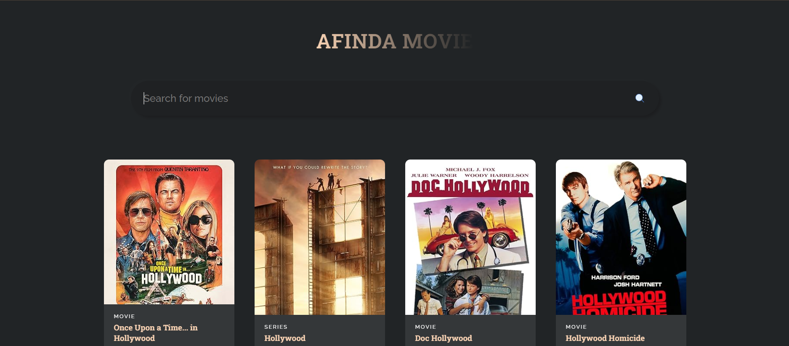

# 🎬 AFINDA MOVIE - Application de Recherche de Films



## 📋 Table des Matières

- [Vue d'ensemble](#vue-densemble)
- [Architecture de l'Application](#architecture-de-lapplication)
- [Technologies Utilisées](#technologies-utilisées)
- [Structure du Projet](#structure-du-projet)
- [Documentation Détaillée du Code](#documentation-détaillée-du-code)
- [Installation et Utilisation](#installation-et-utilisation)
- [Fonctionnalités](#fonctionnalités)
- [Améliorations Futures](#améliorations-futures)

---

## 🎯 Vue d'ensemble

**AFINDA MOVIE** est une application web moderne de recherche de films développée avec React. Elle permet aux utilisateurs de rechercher des films en temps réel via l'API OMDB (Open Movie Database) et d'afficher les résultats dans une interface élégante et responsive.

### Points Clés

- ✅ Interface utilisateur moderne et intuitive
- ✅ Recherche en temps réel via l'API OMDB
- ✅ Affichage dynamique des résultats
- ✅ Design responsive (mobile, tablette, desktop)
- ✅ Effets visuels au survol des cartes de films

---

## 🏗️ Architecture de l'Application

```
┌─────────────────────────────────────────────────────────┐
│                   AFINDA MOVIE APP                       │
│                   (Composant Principal)                  │
└─────────────────────┬───────────────────────────────────┘
                      │
        ┌─────────────┼─────────────┐
        │             │             │
        ▼             ▼             ▼
   ┌────────┐   ┌─────────┐   ┌──────────┐
   │ State  │   │  API    │   │   UI     │
   │Manager │   │ Service │   │Components│
   └────────┘   └─────────┘   └──────────┘
        │             │             │
        │             │             │
        ▼             ▼             ▼
   [useState]    [fetch API]   [MovieCard]
   [useEffect]   [OMDB API]    [SearchBar]
```

### Flux de Données

```
┌──────────────┐
│   Utilisateur│
│  tape query  │
└──────┬───────┘
       │
       ▼
┌──────────────────┐
│  setSearchTerm() │  ← Mise à jour du state
└──────┬───────────┘
       │
       ▼
┌──────────────────┐
│  searchMovies()  │  ← Appel API
└──────┬───────────┘
       │
       ▼
┌──────────────────┐
│   OMDB API       │  ← Récupération des données
│  (HTTP Request)  │
└──────┬───────────┘
       │
       ▼
┌──────────────────┐
│   setMovies()    │  ← Mise à jour du state
└──────┬───────────┘
       │
       ▼
┌──────────────────┐
│ Re-render des    │
│   MovieCards     │  ← Affichage des résultats
└──────────────────┘
```

---

## 💻 Technologies Utilisées

| Technologie | Version | Rôle |
|------------|---------|------|
| **React** | 18.0+ | Framework JavaScript pour l'interface utilisateur |
| **React Hooks** | useState, useEffect | Gestion de l'état et effets de bord |
| **OMDB API** | v1 | Base de données de films |
| **CSS3** | - | Stylisation et animations |
| **Google Fonts** | - | Typographies (Roboto Slab, Raleway) |

---

## 📁 Structure du Projet

```
afinda-movie/
│
├── src/
│   ├── App.js              # Composant principal de l'application
│   ├── App.css             # Styles globaux de l'application
│   ├── MovieCard.jsx       # Composant de carte de film
│   ├── index.js            # Point d'entrée de l'application
│   └── search.svg          # Icône de recherche
│
├── public/
│   └── index.html          # Template HTML
│
├── package.json            # Dépendances et scripts
└── README.md              # Documentation (ce fichier)
```

---

## 📚 Documentation Détaillée du Code

### 1. **App.js** - Le Composant Principal

#### Import des Dépendances

```javascript
import React, { useState, useEffect } from "react";
import MovieCard from "./MovieCard";
import SearchIcon from "./search.svg";
import "./App.css";
```

**Explication :**
- `React, { useState, useEffect }` : Import du cœur de React et des Hooks nécessaires
- `MovieCard` : Import du composant enfant pour afficher chaque film
- `SearchIcon` : Import de l'icône SVG pour le bouton de recherche
- `App.css` : Import des styles globaux

#### Configuration de l'API

```javascript
const API_URL = "http://www.omdbapi.com?apikey=d2b20d60";
```

**Rôle :** Constante contenant l'URL de base de l'API OMDB avec la clé API intégrée.

#### Composant App

```javascript
const App = () => {
    const [searchTerm, setSearchTerm] = useState("");
    const [movies, setMovies] = useState([]);
```

**Gestion de l'État (State) :**

1. **`searchTerm`** : Stocke le texte saisi par l'utilisateur dans la barre de recherche
    - Type : `string`
    - Valeur initiale : `""` (chaîne vide)
    - Mise à jour via : `setSearchTerm()`

2. **`movies`** : Stocke le tableau des films retournés par l'API
    - Type : `array`
    - Valeur initiale : `[]` (tableau vide)
    - Mise à jour via : `setMovies()`

#### Effect Hook - Chargement Initial

```javascript
useEffect(() => {
    searchMovies("Batman");
}, []);
```

**Fonctionnement :**
- `useEffect` : Hook qui exécute du code après le rendu du composant
- `[]` : Tableau de dépendances vide → le code s'exécute **une seule fois** au montage du composant
- `searchMovies("Batman")` : Charge automatiquement les films "Batman" au démarrage de l'application

**Pourquoi "Batman" ?** C'est une recherche par défaut pour afficher du contenu immédiatement à l'utilisateur.

#### Fonction de Recherche Asynchrone

```javascript
const searchMovies = async (title) => {
    const response = await fetch(`${API_URL}&s=${title}`);
    const data = await response.json();
    setMovies(data.Search);
};
```

**Analyse Ligne par Ligne :**

1. **`async (title)`** : Fonction asynchrone qui prend le titre du film en paramètre

2. **`await fetch(...)`** :
    - Effectue une requête HTTP GET vers l'API OMDB
    - URL construite : `http://www.omdbapi.com?apikey=d2b20d60&s=Batman`
    - `await` : Attend la réponse du serveur avant de continuer

3. **`await response.json()`** :
    - Convertit la réponse HTTP en objet JavaScript
    - Format JSON : `{ Search: [...], totalResults: "X", Response: "True" }`

4. **`setMovies(data.Search)`** :
    - Met à jour le state `movies` avec le tableau de films
    - Déclenche automatiquement un re-render du composant

#### Interface Utilisateur (JSX)

```javascript
return (
    <div className="app">
        <h1>AFINDA MOVIE</h1>
```

**Structure :**
- Container principal avec la classe `app`
- Titre de l'application avec effet dégradé (défini dans CSS)

##### Barre de Recherche

```javascript
<div className="search">
    <input
        value={searchTerm}
        onChange={(e) => setSearchTerm(e.target.value)}
        placeholder="Search for movies"
    />
     searchMovies(searchTerm)}
    />
</div>
```

**Fonctionnement Détaillé :**

1. **Input Contrôlé :**
    - `value={searchTerm}` : L'input affiche toujours la valeur du state
    - `onChange={(e) => setSearchTerm(e.target.value)}` : À chaque frappe, met à jour le state
    - Pattern "Controlled Component" de React

2. **Bouton de Recherche :**
    - `` : Utilise une image SVG comme bouton
    - `onClick={() => searchMovies(searchTerm)}` : Déclenche la recherche au clic

##### Affichage Conditionnel des Résultats

```javascript
{movies?.length > 0 ? (
    <div className="container">
        {movies.map((movie) => (
            <MovieCard movie={movie} />
        ))}
    </div>
) : (
    <div className="empty">
        <h2>No movies found</h2>
    </div>
)}
```

**Logique d'Affichage :**

1. **Opérateur Optional Chaining (`?.`)** :
    - Évite l'erreur si `movies` est `null` ou `undefined`
    - Sécurise l'accès à la propriété `length`

2. **Condition Ternaire** :
    - **SI** `movies?.length > 0` (des films existent) :
        - Affiche une grille de cartes de films
        - `movies.map()` : Itère sur chaque film et crée un composant `MovieCard`
    - **SINON** :
        - Affiche un message "No movies found"

---

### 2. **MovieCard.jsx** - Composant de Carte de Film

```javascript
import React from 'react';

const MovieCard = ({ movie: { imdbID, Year, Poster, Title, Type } }) => {
```

**Destructuration des Props :**
- Utilise la destructuration imbriquée pour extraire directement les propriétés de l'objet `movie`
- Props reçues :
    - `imdbID` : Identifiant unique du film
    - `Year` : Année de sortie
    - `Poster` : URL de l'affiche
    - `Title` : Titre du film
    - `Type` : Type (movie, series, episode)

#### Structure de la Carte

```javascript
return (
    <div className="movie" key={imdbID}>
        <div>
            <p>{Year}</p>
        </div>

        <div>
            
        </div>

        <div>
            <span>{Type}</span>
            <h3>{Title}</h3>
        </div>
    </div>
);
```

**Architecture en 3 Sections :**

1. **Section 1 - Année (Overlay caché)** :
    - Contient l'année de sortie
    - Visible uniquement au survol (CSS : `opacity: 0` → `opacity: 1`)

2. **Section 2 - Affiche du Film** :
    - **Gestion du Poster** :
        - Si `Poster !== "N/A"` : Utilise l'image de l'API
        - Sinon : Utilise une image placeholder (400x400px)
    - Empêche l'affichage d'images cassées

3. **Section 3 - Informations du Film** :
    - Type du média (film, série, etc.)
    - Titre du film
    - Positionné en bas de la carte (CSS : `position: absolute; bottom: 0`)

---

### 3. **App.css** - Stylisation et Animations

#### Variables CSS et Reset

```css
@import url("https://fonts.googleapis.com/css?family=Roboto+Slab:100,300,400,700");
@import url("https://fonts.googleapis.com/css?family=Raleway:300,300i,400,400i,500,500i,600,600i,700,700i,800,800i,900,900i");

* {
    margin: 0;
    border: 0;
    box-sizing: border-box;
}

:root {
    --font-roboto: "Roboto Slab", serif;
    --font-raleway: "Raleway", sans-serif;
}
```

**Rôle :**
- Import des polices Google Fonts
- Reset CSS global (suppression des marges/bordures par défaut)
- Variables CSS pour une gestion centralisée des polices

#### Styles de Base

```css
body {
    font-family: var(--font-roboto);
    background-color: #212426;
}
```

**Thème Dark :**
- Fond sombre (#212426) pour un aspect moderne
- Police par défaut : Roboto Slab

#### Container Principal

```css
.app {
    padding: 4rem;
    display: flex;
    justify-content: center;
    align-items: center;
    flex-direction: column;
}
```

**Layout Flexbox :**
- Centrage vertical et horizontal
- Direction colonne (empile les éléments)

#### Titre avec Effet Dégradé

```css
h1 {
    font-size: 3rem;
    letter-spacing: 0.9px;
    background: linear-gradient(
        90deg,
        rgba(249, 211, 180, 1) 0%,
        rgba(249, 211, 180, 0) 100%
    );
    background-clip: text;
    -webkit-background-clip: text;
    -webkit-text-fill-color: transparent;
    width: fit-content;
}
```

**Technique du Dégradé sur Texte :**
1. `linear-gradient` : Crée un dégradé de couleur
2. `background-clip: text` : Clip le fond à la forme du texte
3. `-webkit-text-fill-color: transparent` : Rend le texte transparent pour voir le dégradé

#### Barre de Recherche Neumorphique

```css
.search {
    width: 71%;
    margin: 4rem 0 2rem;
    display: flex;
    align-items: center;
    justify-content: center;
    padding: 1.5rem 1.75rem;
    border-radius: 3rem;
    background: #1f2123;
    box-shadow: 5px 5px 7px #1c1d1f, -5px -5px 7px #222527;
}
```

**Style Neumorphique (Soft UI) :**
- Double ombre pour créer un effet 3D enfoncé
- Bordures arrondies (3rem)
- Fond légèrement différent du body pour le contraste

#### Cartes de Films Interactives

```css
.movie {
    width: 310px;
    height: 460px;
    margin: 1.5rem;
    position: relative;
    border-radius: 12px;
    overflow: hidden;
    transition: all 0.4s cubic-bezier(0.175, 0.885, 0, 1);
    box-shadow: 0px 13px 10px -7px rgba(0, 0, 0, 0.1);
}
```

**Propriétés Clés :**
- `position: relative` : Permet le positionnement absolu des enfants
- `overflow: hidden` : Cache les éléments qui dépassent (effet propre)
- `transition` : Animation fluide avec courbe de Bézier personnalisée
- `box-shadow` : Ombre portée subtile

#### Effets au Survol

```css
.movie:hover {
    box-shadow: 0px 30px 18px -8px rgba(0, 0, 0, 0.1);
    transform: scale(1.05, 1.05);
}

.movie:hover div:nth-of-type(2) {
    opacity: 0.3;
}

.movie:hover div:nth-of-type(1) {
    opacity: 1;
}
```

**Séquence d'Animation au Survol :**
1. Carte grandit de 5% (`scale(1.05)`)
2. Ombre devient plus prononcée
3. Image devient semi-transparente (30%)
4. Année apparaît en overlay (opacité 0 → 1)
5. Fond des infos devient transparent

#### Design Responsive

```css
@media screen and (max-width: 600px) {
    .app {
        padding: 4rem 2rem;
    }
    .search {
        padding: 1rem 1.75rem;
        width: 100%;
    }
}

@media screen and (max-width: 400px) {
    h1 {
        font-size: 2rem;
    }
    .movie {
        width: "100%";
        margin: 1rem;
    }
}
```

**Breakpoints :**
- **600px** : Tablettes (ajustement des paddings)
- **400px** : Mobile (réduction des tailles de police, cartes full-width)

---

### 4. **index.js** - Point d'Entrée

```javascript
import { StrictMode } from 'react';
import { createRoot } from 'react-dom/client';
import App from './App';

createRoot(document.getElementById('root')).render(
    <StrictMode>
        <App />
    </StrictMode>
);
```

**Rôle de Chaque Élément :**

1. **`StrictMode`** :
    - Mode de développement qui active des vérifications supplémentaires
    - Détecte les problèmes potentiels (effets de bord, API dépréciées)
    - N'affecte pas le build de production

2. **`createRoot`** :
    - Nouvelle API React 18 pour le rendu concurrent
    - Remplace `ReactDOM.render()` de React 17
    - Permet des fonctionnalités comme le Suspense et les transitions

3. **`document.getElementById('root')`** :
    - Sélectionne l'élément DOM où l'application sera montée
    - Correspond à `<div id="root"></div>` dans `index.html`

---

## 🚀 Installation et Utilisation

### Prérequis

- Node.js (version 14 ou supérieure)
- npm ou yarn

### Installation

```bash
# Cloner le repository
git clone https://github.com/votre-username/afinda-movie.git

# Accéder au dossier
cd afinda-movie

# Installer les dépendances
npm install
# ou
yarn install
```

### Lancement de l'Application

```bash
# Mode développement
npm start
# ou
yarn start
```

L'application sera accessible sur `http://localhost:3000`

### Build de Production

```bash
# Créer un build optimisé
npm run build
# ou
yarn build
```

---

## ✨ Fonctionnalités

### 1. Recherche en Temps Réel
- Barre de recherche interactive
- Déclenchement de la recherche au clic ou à la touche Entrée
- Affichage immédiat des résultats

### 2. Affichage Dynamique
- Grille responsive de cartes de films
- Animation au survol pour une meilleure UX
- Placeholder pour les affiches manquantes

### 3. Design Moderne
- Interface Dark Mode
- Effets neumorphiques sur la barre de recherche
- Dégradé de texte sur le titre
- Transitions fluides

### 4. Responsive Design
- Adapté aux écrans desktop, tablette et mobile
- Breakpoints optimisés pour différentes tailles d'écran

---

## 🔮 Améliorations Futures

### Fonctionnalités Prévues

- [ ] **Pagination** : Gérer plus de 10 résultats
- [ ] **Filtres Avancés** : Par année, type, note
- [ ] **Page Détail** : Afficher plus d'informations sur chaque film
- [ ] **Favoris** : Sauvegarder les films préférés (LocalStorage)
- [ ] **Mode Clair/Sombre** : Toggle entre les thèmes
- [ ] **Recherche à la Volée** : Suggestions pendant la frappe
- [ ] **Gestion d'Erreurs** : Messages d'erreur pour les appels API échoués
- [ ] **Loading State** : Indicateur de chargement pendant les requêtes
- [ ] **Recherche par Catégorie** : Genre, acteur, réalisateur

### Optimisations Techniques

- [ ] **Debouncing** : Limiter les appels API lors de la frappe
- [ ] **Cache** : Sauvegarder les résultats déjà recherchés
- [ ] **Lazy Loading** : Charger les images progressivement
- [ ] **Tests Unitaires** : Jest + React Testing Library
- [ ] **TypeScript** : Migration pour une meilleure maintenabilité
- [ ] **Context API** : Gestion d'état globale pour les favoris

---

## 🤝 Contribution

Les contributions sont les bienvenues ! N'hésitez pas à :

1. Fork le projet
2. Créer une branche pour votre fonctionnalité (`git checkout -b feature/AmazingFeature`)
3. Commit vos changements (`git commit -m 'Add some AmazingFeature'`)
4. Push vers la branche (`git push origin feature/AmazingFeature`)
5. Ouvrir une Pull Request

---

## 📄 Licence

Ce projet est sous licence MIT. Voir le fichier `LICENSE` pour plus d'informations.

---

## 👤 Auteur

**Bonevy BEBY -Software Engineer* 

- LinkedIn : [@bonevybeby](https://www.linkedin.com/in/bonevybeby/)
- GitHub : [@zoulou421](https://github.com/zoulou421/)
- Email : bonevybeby@gmail.com
- Tel: +221 77 862 72 72

---

## 🙏 Remerciements

- [OMDB API](http://www.omdbapi.com/) - Pour la base de données de films
- [React Documentation](https://react.dev/) - Pour les excellentes ressources
- [Google Fonts](https://fonts.google.com/) - Pour les polices utilisées

---

## 📊 Statistiques du Projet

- **Langage Principal** : JavaScript
- **Framework** : React
- **Lignes de Code** : ~200
- **Composants** : 2
- **API Utilisée** : OMDB
- **Responsive** : ✅ Oui

---

**⭐ Si vous aimez ce projet, n'hésitez pas à lui donner une étoile sur GitHub !**

---

*Développé avec ❤️ et React*